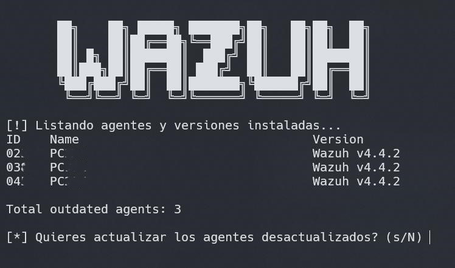

# Update Wazuh Agents

- Este script realizado en Bash, actualiza todos los agentes a la última versión disponible en los repositorios, uno a uno.

  

- Hace uso de la utilidad interna de Wazuh llamada "agent_upgrade", pero listando uno a uno cada agente desplegado y dando la opción de actualizarlos.
